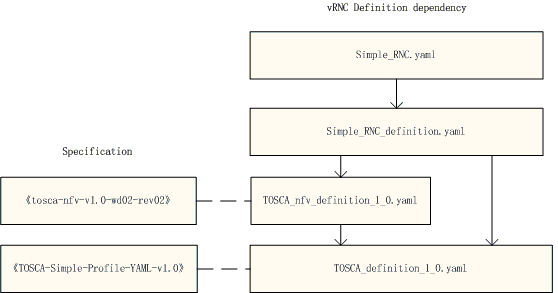

.. This work is licensed under a Creative Commons Attribution 4.0 International License.
.. http://creativecommons.org/licenses/by/4.0

======================================
OPNFV Parser tosca2heat - New Keywords
======================================

1.NFV-tosca new keywords
------------------------

All keywords in nfv tosca are not implemented in code, and will be
implemented by parser.

1.1 Nodes types
~~~~~~~~~~~~~~~

Basic types
^^^^^^^^^^^

* tosca.nodes.nfv.VDU
* tosca.nodes.nfv.CP
* tosca.nodes.nfv.VL

Extend types
^^^^^^^^^^^^

* tosca.nodes.nfv.VL.ELine
* tosca.nodes.nfv.VL.ELAN
* tosca.nodes.nfv.VL.ETree
* tosca.nodes.nfv.FP

1.2 Capability types
~~~~~~~~~~~~~~~~~~~~

Basic types
^^^^^^^^^^^

* tosca.capabilities.nfv.VirtualBindable
* tosca.capabilities.nfv.VirtualLinkable
* tosca.capabilities.nfv.HA.ActiveActive
* tosca.capabilities.nfv.HA.ActivePassive
* tosca.capabilities.nfv.Metric

Extend types
^^^^^^^^^^^^

* tosca.capabilities.nfv.Forwarder
* tosca.capabilities.nfv.CPU\_extension
* tosca.capabilities.nfv.Memory\_extension
* tosca.capabilities.nfv.Hypervisors
* tosca.capabilities.nfv.PCIe
* tosca.capabilities.nfv.network.Interfaces
* tosca.capabilities.nfv.network.Virtual\_switches
* tosca.capabilities.nfv.Storage

1.3 Relationship types
~~~~~~~~~~~~~~~~~~~~~~

Basic types
^^^^^^^^^^^

* tosca.relationships.nfv.VirtualBindsTo
* tosca.relationships.nfv.VirtualLinksTo
* tosca.relationships.nfv.HA
* tosca.relationships.nfv.Monitor

Extend types
^^^^^^^^^^^^

* tosca.relationships.nfv.ForwardsTo

1.4 Group Types
~~~~~~~~~~~~~~~

* tosca.groups.nfv.VNFFG

2.Simple-tosca new keywords
---------------------------

Some keywords are only defined in tosca simple profile,but are not
supported in tosca-paser, and some keywords such as "policy type", are not yet defined
completely so far.

2.1 topology template keyname
~~~~~~~~~~~~~~~~~~~~~~~~~~~~~

* "substitution\_mappings" syntax

    An optional declaration that exports the topology template as an
    impletmentation of a node type, which is not supported by tosca-parser.

2.2 Group types
~~~~~~~~~~~~~~~

Basic types
^^^^^^^^^^^

* tosca.group.root

2.3 Policy Types
~~~~~~~~~~~~~~~~

Basic types
^^^^^^^^^^^

* tosca.policies.Root
* tosca.policies.Placement
* tosca.policies.Scaling

Extend types
^^^^^^^^^^^^

* tosca.policies.Update
* tosca.policies.Performance
* tosca.policy.placement.Antilocate
* tosca.policy.placement.Colocate

=======================================
OPNFV Parser tosca2heat - vRNC Topology
=======================================

The simple vRNC topology is shown below: :numref:`figure_topo`

.. figure:: images/vRNC_Topology.png
   :name: figure_topo
   :width: 100%

   vRNC Topology

-  vRNC includes four networks: EMS\_network, CTRL\_network,
   Intermedia\_network and extermedia\_network;
-  vRNC includes four node types: MM, LB, CM and DM;
-  MM: Stands for Maintain Module, which links to EMS\_network,
   CTRL\_network and extermedia\_network. It composes of active vdu and
   standby vdu.
-  CM: Stands for Control Module, which links to CTRL\_network and
   intermedia\_network. All CM nodes form resource pool and each node
   composes of active vdu and standby vdu.
-  DM: Stands for Data Module, which links to CTRL\_network and
   intermedia\_network. All DM nodes form resource pool and each node is
   a vdu.
-  LB: Stands for LineCard Module, which links to CTRL\_network and
   intermedia\_network and extermedia\_network. All LB nodes form
   resource pool and each node is a vdu.

=========================================
OPNFV Parser tosca2heat - vRNC Definition
=========================================

The files dependency and correspoding specificaiton of vRNC definition
are shown below: :numref:`figure_def`

   vRNC Definition

-  TOSCA\_definition\_1.0.yaml should be the lastest version, which is
   updated by tosca-parser community, but some keywords (such as
   substitution\_mappings) in the correspoding standard of
   "TOSCA-simple-profile-YAML-v1.0" is not supported.
-  TOSCA\_nfv\_definition\_1.0.yaml is a new file, and not implemented
   in code, and the correspoding standard of
   "tosca-nfv-v1.0-wd02-rev02" is not complete now.
