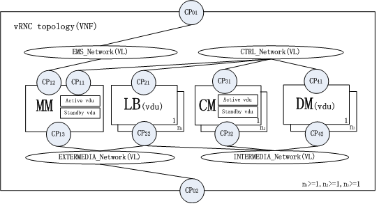

# 1. vRNC Topology #
The simple vRNC topology is shown below:

- vRNC includes four networks：EMS_network、CTRL_network、 Intermedia_network and extermedia_network;
- vRNC includes four node types：MM、LB、CM and DM;
- MM: Stands for Maintain Module,which links to EMS_network、CTRL_network and extermedia_network.It composes of active vdu and standby vds.
- CM: Stands for Control Module,which links to CTRL_network and
intermedia_network.All CM nodes form resource pool and each node composes of active vdu and standby vds.
- DM: Stands for Data Module,which links to CTRL_network and
intermedia_network.All DM nodes form resource pool and each node is a vds.
- LB: Stands for LineCard Module,which links to CTRL_network and
intermedia_network and extermedia_network.All LB nodes form resource pool and each node is a vds.

# 2. vRNC Definition #
 The files dependency and correspoding specificaiton of vRNC definition are shown below：

- TOSCA_definition_1.0.yaml should be the lastest version,which is updated by tosca-parser community,but some keynames (such as substitution_mappings) in the correspoding standard of 《TOSCA-simple-profile-YAML-v1.0》 is not supported.
- TOSCA_nfv_definition_1.0.yaml is a new file,and not implemented in code,and the correspoding standard of 《tosca-nfv-v1.0-wd02-rev02》 is not complete now.
 