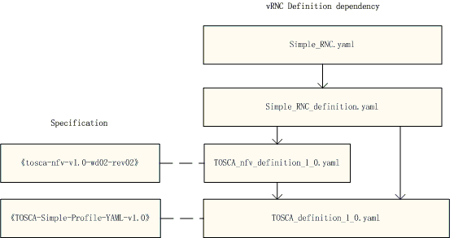

..
 This work is licensed under a Creative Commons Attribution 3.0 Unported
 License.

 http://creativecommons.org/licenses/by/3.0/legalcode

================
1. vRNC Topology
================

The simple vRNC topology is shown below: |vRNC Topology|

-  vRNC includes four networks: EMS\_network, CTRL\_network,
   Intermedia\_network and extermedia\_network;
-  vRNC includes four node types: MM, LB, CM and DM;
-  MM: Stands for Maintain Module, which links to EMS\_network,
   CTRL\_network and extermedia\_network. It composes of active vdu and
   standby vdu.
-  CM: Stands for Control Module, which links to CTRL\_network and
   intermedia\_network. All CM nodes form resource pool and each node
   composes of active vdu and standby vdu.
-  DM: Stands for Data Module, which links to CTRL\_network and
   intermedia\_network. All DM nodes form resource pool and each node is
   a vdu.
-  LB: Stands for LineCard Module, which links to CTRL\_network and
   intermedia\_network and extermedia\_network. All LB nodes form
   resource pool and each node is a vdu.

2. vRNC Definition
==================

The files dependency and correspoding specificaiton of vRNC definition
are shown below: |vRNC Definition|

-  TOSCA\_definition\_1.0.yaml should be the lastest version, which is
   updated by tosca-parser community, but some keywords (such as
   substitution\_mappings) in the correspoding standard of
   "TOSCA-simple-profile-YAML-v1.0" is not supported.
-  TOSCA\_nfv\_definition\_1.0.yaml is a new file, and not implemented
   in code, and the correspoding standard of
   "tosca-nfv-v1.0-wd02-rev02" is not complete now.

.. |vRNC Topology| image:: image/vRNC_Topology.bmp

